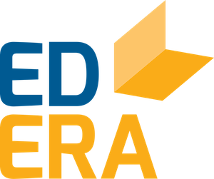
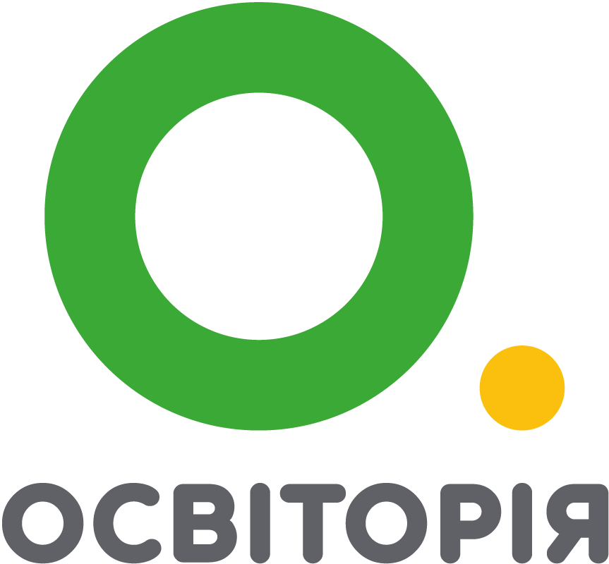
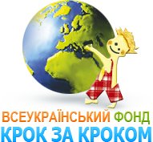
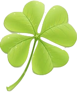
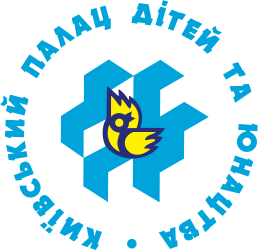

# Інтерактивний посібник-глосарій для вчителів початкових класів

1. [Що таке глосарій?](#glosariy)
2. [Зручність та адаптивність](#zruchnist)
3. [Коментарі](#testy)
4. [Індексація в Google](#google)

##Що таке глосарій?  {#glosariy}

Інтерактивний посібник з навчальними відео та інформацією з дистанційного курсу <a href="https://courses.ed-era.com/courses/course-v1:MON-EDERA-OSVITORIA+ST101+st101/about" target="_blank">«Онлайн-курс для вчителів початкової школи»</a> задля швидкого доступу до важливої та корисної інформації. 

##Зручність та адаптивність {#zruchnist}

Посібник адаптує сторінки під будь-який гаджет. Також є можливість змінювати розмір кеглю та режими перегляду (денний, нічний, сепія).

##Коментарі {#testy}

На кожній сторінці посібника є можливість публікувати коментарі зворотного зв'язку, брати участь у обговоренні та конструктивній дискусії, ділитися власним практичним досвідом у реалізації продемонстрованих методик.

##Індексація в Google {#google}

На кожну сторінку посібника можна потрапити із запиту Google. Також з кожної сторінки за посиланням можна потрапити у повну версію онлайн-курсу.

<a href="https://edera.gitbooks.io/glossary/zmist.html" target="_blank"><button type="button" class="btn btn-primary" aria-haspopup="true" aria-expanded="false">Перейти до змісту</button></a>

  <!-- Nav tabs -->
  <ul class="nav nav-tabs" role="tablist">
    <li role="presentation" class="active"><a href="#home" aria-controls="home" role="tab" data-toggle="tab"><b>Організації-розробники</b></a></li>
    <li role="presentation"><a href="#menu41" aria-controls="menu41" role="tab" data-toggle="tab"><b>Партнери</b></a></li>
    <li role="presentation"><a href="#menu42" aria-controls="menu42" role="tab" data-toggle="tab"><b>За підтримки</b></a></li>
  </ul>
  <!-- Tab panes -->
  

    

   <table>
        <tr style="border-top: none;">
          <td width="120px" align="center" style="padding:0; border: none;">
          
          </td>
          <td valign="middle"  align="left" style="border: none;">
            <b>Міністерство освіти й науки України</b> – центральний орган виконавчої влади, що формує та реалізує державну політику у сфері освіти і науки.
          </td>
        </tr>
              <tr style="border-top: none;">
        <td width="120px" align="center" style="padding:0; border: none;">
        
        </td>
        <td valign="middle"  align="left" style="border: none;">
            <b>EdEra</b> – студія онлайн-освіти, що створює онлайн-курси, інтерактивні підручники, освітні спецпроекти та моделі інтеграції сучасних освітніх рішень у традиційний навчальний процес. Мета діяльності – зробити освіту в Україні якісною, доступною та наявною в глобальному освітньому контексті. 
        </td>
              </tr>
               <tr style="border-top: none;">
        <td width="120px" align="center" style="padding:0; border: none;">
        
        </td>
        <td valign="middle"  align="left" style="border: none;">
            <b>ГС «Освіторія»</b> – неприбуткова громадська спілка, яка допомагає змінювати і розвивати освіту в Україні. Створює інноваційні школи і програми, допомагає вчителям навчатись та надає доступ до якісної освіти малозабезпеченим дітям.
        </td>
              </tr>     
  </table>
  

    

   <table>
        <tr style="border-top: none;">
          <td width="120px" align="center" style="padding:0; border: none;">
          
          </td>
          <td valign="middle"  align="left" style="border: none;">
            <b>НВК «Новопечерська школа»</b> – сучасна українська школа з глобальним мисленням і українським серцем. Створена в 2014 році як пілот для подальшої реформи усієї системи середньої освіти в Україні. Провідні українські педагоги і консультанти Канадського бюро міжнародної освіти (СВІЕ) розробили в Новопечерській школі унікальну педагогічну програму, поєднавши українські національні стандарти з найкращими світовими методиками. І тепер наші вчителі є експертами і допомагають Міністерству освіти і науки впроваджувати інноваційні методики в інших українських школах.
          </td>
        </tr>
              <tr style="border-top: none;">
        <td width="120px" align="center" style="padding:0; border: none;">
        
        </td>
        <td valign="middle"  align="left" style="border: none;">
            <b>ВФ «Крок за кроком»</b> – всеукраїнська благодійна організація, місія якої сприяти втіленню освітніх реформ із реалізації особистісно-орієнтованої, інклюзивної освітньої моделі з активним залученням сімей і громад шляхом проведення тренінгів для освітян, батьків, представників громадських організацій; ініціювання та реалізації проектів, спрямованих на забезпечення рівного доступу до якісної освіти для всіх дітей, включаючи дітей з особливими потребами; залучення сімей і громади до освітнього та управлінського процесів.
      </td>
      </tr>
               <tr style="border-top: none;">
        <td width="120px" align="center" style="padding:0; border: none;">
        
        </td>
        <td valign="middle"  align="left" style="border: none;">
            <b>ЦПД «Рівновага»</b> – центр психологічної допомоги дітям з труднощами в навчанні.
      </td>
      </tr>     
<tr style="border-top: none;">
        <td width="120px" align="center" style="padding:0; border: none;">
       
        </td>
        <td valign="middle"  align="left" style="border: none;">
            <b>Київський палац дітей та юнацтва</b> – державний позашкільний навчальний заклад. Навчання проводиться за 200 напрямками. Навчання проводиться на різних рівнях — від початкового ознайомлення до професійної підготовки.
      </td>
      </tr>  
      </table>

    

   <table>
        <tr style="border-top: none;">
          <td width="120px" align="center" style="padding:0; border: none;">

          </td>
          <td valign="middle"  align="left" style="border: none;">
            <b>ЛМГО «Центр освітньої політики»</b> – центр ставить собі за мету сприяти розвиткові в Україні системи освіти, яка створює рівні можливості та умови для розвитку особистості і творчої самореалізації кожного громадянина України, виховує покоління людей, здатних ефективно працювати і навчатися впродовж життя, оберігати й примножувати цінності національної культури та громадянського суспільства, розвивати і зміцнювати суверенну, незалежну, демократичну, соціальну та правову державу як невід'ємну складову європейської та світової спільноти.
          </td>
        </tr>   
      </table>
    

  

